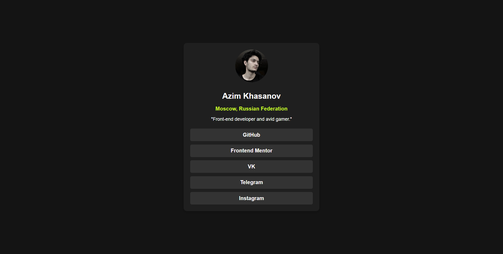

# Social Links Profile



## Project Overview

This project is a responsive social links profile webpage. It allows users to view hover and focus states for interactive elements, providing a sleek and accessible interface.

## Features

- **Responsive Design**: Optimized for desktop and mobile devices.
- **Interactive Elements**: Smooth hover and focus states for buttons and links.
- **Clean Aesthetics**: Simple yet elegant UI design.

## Live Preview

Check out the live version of the project here: [Social Links Profile](https://social-link-profile-taupe.vercel.app/)

## Repository

Explore the codebase on GitHub: [GitHub Repository](https://github.com/AxM133/Social_Link_Profile)

## Technology Stack

- **HTML5**
- **CSS3**
- **JavaScript**

## How to Use

1. Clone the repository:
   ```bash
   git clone https://github.com/AxM133/Social_Link_Profile.git
   ```
2. Open the `index.html` file in your browser to view the project locally.
